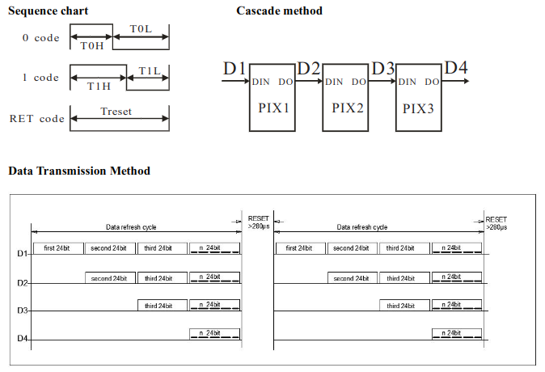

# Smart LED Driver

## Introduction

This is an driver for WS28xx RGB LEDs. This is used to run on a FPGA and is written in VHDL. It converts input data from a SPI interface to serial data that drives the LEDs.

Should work with all WS28xx LEDs. Tested with WS2812B and WS2815B. See [Testing](#testing).

WS2812B -V5, WS2812B-B -V5, WS2812B-2020, WS2812B-MINI, WS2812C, WS2812C-2020, WS2812D-F5, WS2812D-F8, WS2812E, WS2812S, WS2813A, WS2813B, WS2813B-MINI, WS2813C, WS2813C-2020, WS2813D, WS2813E, WS2815B, WS2815B -V3, WS2815B-B

## SPI Interface

One LED needs 24 bits. One byte per color RGB. So the control 20 LEDs you have to transmit 20 * 3 bytes = 60 bytes of data. Excess data will be ignored. It is important to set the LED_COUNT constant in the toplevel module correct!
The internal logic keeps the recieved data in order until send out as serial signal to the LEDs.
The SPI interface acts as a söave and was testes sucessfully with a SPI clock frequency of 21.2 MHz with a 12 MHz system clock.

Note: Most LED types using GRB color format instead of standard RGB data format so keep in mind to send the bytes in the correct order!

## Serial data output



For more information see datasheet of your part. See [Useful links](#useful-links).

## Usage

### Pinout

| Name          | Pin | Description                 |
| ------------- | --- | --------------------------- |
| clock_out     | D1  | 12 Mhz onboard clock output |
| reset_n       | B3  | Async. low-active reset     |
| spi_clk_in    | B1  | SPI clock input             |
| spi_mosi_in   | A1  | SPI Mosi input              |
| spi_ss_in     | E2  | SPI slave select input      |
| serial_out    | A3  | Serial LED signal output    |
| interrupt_out | B6  | Interrupt output            |

See [pinmap.pcf](synth/pinmap.pcf).

### Configuration

| Constant   | Description                   |
| ---------- | ----------------------------- |
| LED_COUNT  | Number of LEDs                |
| CLOCK_FREQ | System clock frequency        |
| LOW_TIME   | 0-code, High-level time       |
| HIGH_TIME  | 1-code, High-level time       |
| TOTAL_TIME | Time per bit -> mostly 1.25µs |
| RESET_TIME | Duration of the reset break   |

The project configuration is done at the beginning of the toplevel module [smart_led_driver_rtl.vhd](src/smart_led_driver_rtl.vhd).

## Simulation

```console
$ make sim
$ gtkwave sim/smart_led_driver.ghw &
```

## Synthesis

The project was configured for the iCE40LP1K-CM36 FPGA.
See [Makefile](Makefile).

Synthesize:
```console
$ make build
```

Flash:
```console
$ make flash
```

Netlist viewer:
```console
$ make show
```

#### Configuration

LED count = 384 LEDs\
Clock freq. = 12 Mhz\
Timings for WS2812B LEDs.

#### Device utilisation
```
ICESTORM_LC:    226/ 1280    17%
ICESTORM_RAM:     4/   16    25%
       SB_IO:     7/  112     6%
       SB_GB:     3/    8    37%
ICESTORM_PLL:     0/    1     0%
SB_WARMBOOT:      0/    1     0%
```

#### Timing analysis
```
Max frequency for clock 'spi_clk_in$SB_IO_IN_$glb_clk': 137.44 MHz (PASS at 12.00 MHz)
Max frequency for clock      'clock$SB_IO_IN_$glb_clk': 118.16 MHz (PASS at 12.00 MHz)

Max delay <async>                              -> posedge clock$SB_IO_IN_$glb_clk     : 4.70 ns
Max delay <async>                              -> posedge spi_clk_in$SB_IO_IN_$glb_clk: 8.13 ns
Max delay posedge clock$SB_IO_IN_$glb_clk      -> <async>                             : 8.96 ns
Max delay posedge spi_clk_in$SB_IO_IN_$glb_clk -> posedge clock$SB_IO_IN_$glb_clk     : 3.72 ns
```

## Testing

#### Conditions

It was tested with the iCESugar-nano FPGA board which is based on the Lattice iCE40LP1K-CM36 FPGA.
The SPI signal was generated by a STM32 Nucleo-F446RE. The SPI clock frequency = 21.2 MHz.

#### WS2812B - LED Cube

TODO

#### WS2815B - LED Matrix

TODO

## Useful links

iCESugar-nano Github Project\
https://github.com/wuxx/icesugar-nano

LED WS28xx Overview\
https://docs.google.com/spreadsheets/d/1XuypEHJ6EJb4g1ueQG16nt9-8UFYQO5HtJiBW11wCBg/edit?usp=sharing

## TODO

- Support for LEDs with four channels (extra white channel)
- Dynamic LED count (LED count should depend on the recieved bytes)

## License

[Open license](LICENSE)